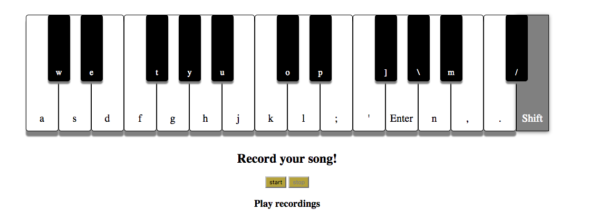

## Electric Piano

[Electric Piano Live][piano]

[piano]: http://www.marknoizumi.com/piano/

Electric piano is built using React/Redux.  It is entirely a front-end project and resembles a miniature keyboard I played with as a kid that recorded songs.  

The black keys use an absolute position with a negative margin in the css.

The state saves recorded tracks until they are deleted.
